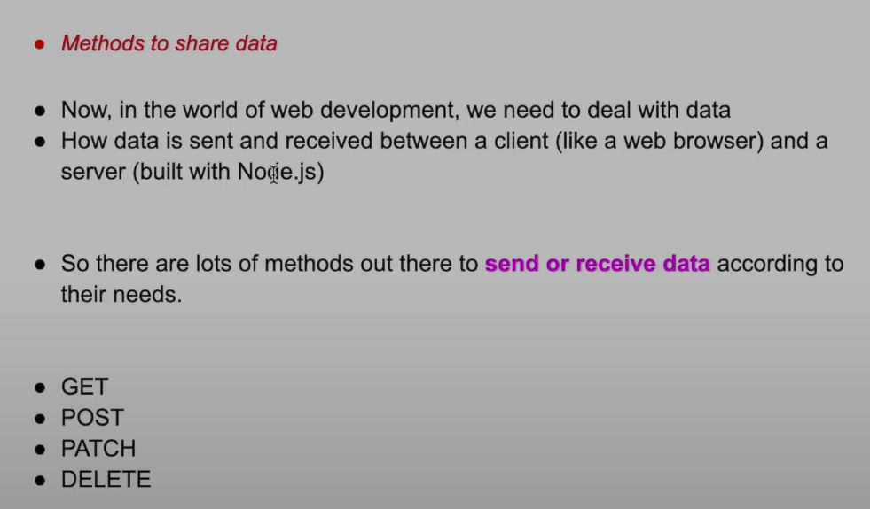
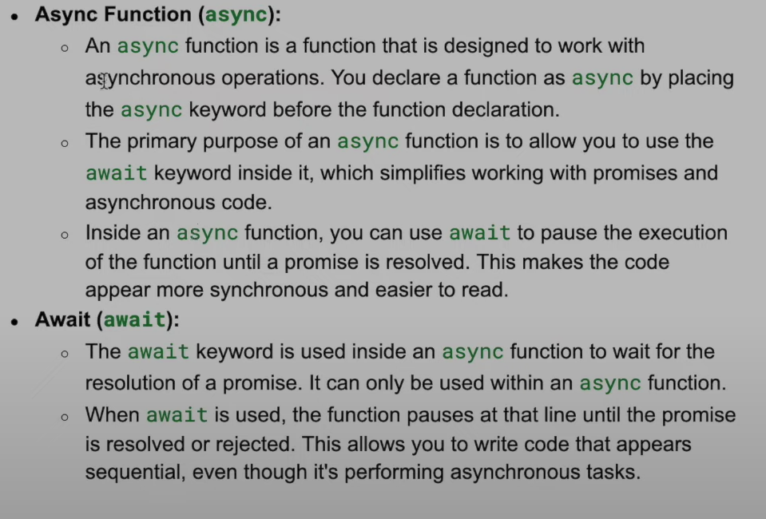

# Node Js :-

- **How to take input in JS ?**

*Solution* :

    * TO TAKE INPUT IN JS , WE USE 'PROMPT()'
    * In terminal : npm i prompt-sync
    * Include it in the top of the program using 
    * let prompt = require('prompt-sync')();

```js
let prompt = require('prompt-sync')();

let number = prompt('Enter a number : ')

console.log(`Input No. is ${number}`);

console.log(typeof(number)); // String
```

- **When you run `npm init` , this message appears to guide you through setting up a new package.json**

- **What is package.json in NODE ?**

 

  *_Learn :_ CallBack Functions , IIFE

 - Modules : fs & os [IMP]

 ```js
let fs = require('fs');
let os = require('os');
 ```

_Ex :_


- **How to import files in JS ?**

_Ans :_ Create another file names 'notes.js', and write a console in it.
In main file :
```js
const notes = require('./notes.js')
```

- **Module.export() in ES6** : In the 'notes.js' declare a var, and now we will use it in server.js . So we need to export it by :


now in server.js , we will use it by :- 

```js
const notes = require('./notes.js')

let res = notes.addNumber(2,5)

console.log(res) // 7
```
***

## **Lodash Basics in Node.js**

Lodash is a popular utility library in JavaScript, useful for handling arrays, objects, strings, and more. It simplifies code, helps avoid repetitive patterns, and is especially helpful in Node.js projects.


NPM : `npm install lodash`

# Lodash - Splitting an Array into Chunks with `_.chunk`

* 1. `_.chunk` - Splitting an Array into Chunks

- **Description**: Splits an array into chunks of a specified size.
- **Syntax**: `_.chunk(array, size)`

### Example:

```javascript
const _ = require('lodash');

// Splitting an array into chunks of 2
const result = _.chunk(['a', 'b', 'c', 'd'], 2);
console.log(result);
```

*  2. `_.uniq` - Removing Duplicate Values from an Array

- **Description**: Removes duplicate values from an array, returning only unique values.
- **Syntax**: `_.uniq(array)`

### Example:

```javascript
const _ = require('lodash');

// Removing duplicates from an array
const result = _.uniq([1, 2, 2, 3, 4, 4, 5]);
console.log(result); // [1, 2, 3, 4, 5]
```

* 3. `_.merge` - Merging Properties of Two Objects

- **Description**: Merges properties of two objects, with overlapping properties in the second object overwriting those in the first.
- **Syntax**: `_.merge(object, sources)`

### Example:

```javascript
const _ = require('lodash');

const object1 = { a: 1, b: 2 };
const object2 = { b: 3, c: 4 };

// Merging two objects
const result = _.merge(object1, object2);
console.log(result); // { a: 1, b: 3, c: 4 }
```

* 4. `_.capitalize` - Capitalizing the First Letter of a String

- **Description**: Capitalizes only the first letter of a string, while the rest of the string remains lowercase.
- **Syntax**: `_.capitalize(string)`

### Example:

```javascript
const _ = require('lodash');

// Capitalizing the first letter of a string
const result = _.capitalize('hello world');
console.log(result); // Hello world
```

* 5. `_.range` - Creating an Array of Numbers in a Specified Range

- **Description**: Creates an array of numbers in a specified range. By default, it starts at 0 and increments by 1.
- **Syntax**: `_.range([start=0], end, [step=1])`

### Example:

```javascript
const _ = require('lodash');

// Creating an array from 1 to 4
const result = _.range(1, 5);
console.log(result); // [1, 2, 3, 4]
```


- JSON : (JS Object Notation)


```js
CONVERTING STRING TO OBJECT
const str = '{"name":"nodeJs","age":30}'; // Valid JSON with double quotes (string)

const jsonObj = JSON.parse(str); // Converts JSON string to object (object)

console.log(typeof jsonObj); // Output: nodeJs
console.log(jsonObj.name); // nodeJs

CONVERTING OBJECT TO STRING

const obj = {
    name: "nodeJs",
    age: 18,

    isValid: function() {
        console.log(`Hey`);
    }
};

const objToJsonStr = JSON.stringify(obj); // Fixed method name

console.log(typeof obj);          // Output: object
console.log(typeof objToJsonStr); // Output: string

```
- **What are api and End points ?**
```
```



- CREATING SERVER IN NODE JS :-

 * In terminal : `npm i express`
 * In terminal : `npm i nodemon`

```js
COPY THE CODE BELOW FROM NPM EXPRESS , AND IN BROWSER SEARCH FOR 'localhost:3000'

const express = require('express')
const app = express()

app.get('/', function (req, res) {
  res.send('Amil')
})

app.listen(3000)
```
```js

Ex:
const express = require('express')
const app = express()

app.get('/', function (req, res) {
  res.send('Amil')
})

app.get('/node', function(req,res){
    res.send(`NodeJs Working...`)
})

app.get('/biryani', function(req,res){

    const obj = {
        name : "Biryani",
        type : "Chicken",
        isVal : true
    }

    res.send(obj)
})


app.listen(3000)
```

- **HOW TO USE POSTMAN AND WHY ?**

In-terminal : `npm i nodemon`

_ANS:_ 
 
 - 'server.js' ko `nodemon server.js`
 - Search for 'localhost:3000' -> 'http://localhost:3000/' in the POSTMAN

 - AND KEEP HITTING '/node', '/biryani', '/item' 

- **MONGODB :** Is no sql database

 * To enter server of mongodb in terminal : `mongod`
 * Now, enter shell to write query : `mongosh`
 * _QUERIES_ :- 

 
 
 
 
 
 
 

 - MongoDB COMPASS :

 

- _Now, from the terminal_ :-


- Copy : `mongodb://127.0.0.1:27017` & paste in MongoDB Compass. 

- Now manage DB in GUI mode.

` NOTE : `*AND THIS IS HOW WE CONNECT FRONT-END , SERVER AND BACKEND*

- 


- MONGOOSE :-


### DB Connection :-


 - Terminal : `npm i mongoose`


```js
1. Make a New File , 'db.js'

WRITE THE BELOW CODE :-

// 1.
const mongoose = require('mongoose')

// 2. Define URL
const mongoURL = 'mongodb://localhost:27017/hotels'

// 3. mongo connection
mongoose.connect(mongoURL)

// 4. maintaining default connection object 
const db = mongoose.connection

// 5. Defining event listeners
db.on('connected', function(){
    console.log(`Connected to MongoDB server`);
})

db.on('error', function(err){
    console.log(`Error : ${err}`);
})

db.on('disconnected', function(){
    console.log(`Disconnected from MongoDB server`);
})

// Last : Exporting
module.exports = db;
```
```JS
2. In the pre-existing code in 'server.js', add,

    const db = require('./db')

    THEN START THE SERVER FROM THE TERMINAL > POSTMAN

```

- TO START AND STOP THE MONGODB SERVER , GO TO 'WIN+R' -> ` services.msc`: START/STOP from here !

### Models in Mongoose


- Now we make folder named 'models' and inside it a file named 'person.js'

And inside the file :


- Now export this inside the 'server.js',

    `const Person = require('./models/Person')`

*
- BODY PARSER :

-Add this in 'server.js' :-


### Async & Await :



- EX :


## POST & GET METHOD :- _Sending and receiving data to/from database._

- Step 1 :- Make a Folder, and inside it a file named (which end point we've to hit)

EX: 

Step 2 :-  Inside this (menu.js) , define Mongoose Schema ,

```js

const mongoose = require('mongoose');

const menuSchema = new mongoose.Schema({
    name: {
        type: String,
        required: true
    },
    price: {
        type: Number,
        required: true
    },
    taste: {
        type: String,
    },
    ingredients: {
        type: [String],
        validate: {
            validator: function(v) {
                return v.length <= 3; // Ensures exactly three ingredients
            },
            message: props => `${props.value} must have exactly three ingredients` // Added custom error message
        }
    },
    num_sales: {
        type: Number
    }
});

const Menu = mongoose.model('Menu', menuSchema);
module.exports = Menu;

```

- Step 3 :- Inside 'Server.js' we will require this file by , 

```js
const express = require('express')
const app = express()

const db = require('./db');

const bodyParser = require('body-parser');
app.use(bodyParser.json());

const Person = require('./Models/persons')

const Menu = require('./Models/menu')
.
. // post methods
.// get methods
.
app.listen(3000);

```

- Step 4 : POST Method in the server.js File.

```js
// POST : Menu
app.post('/menu', async (req,res) =>{

    try{
        const data = req.body;
        const newMenu = new Menu(data);
        const response = await newMenu.save();
        console.log(`Data Saved !`);
        res.status(200).json(response);
    }catch(err){
        console.log(err);
        res.status(500).json({Error:`Internal Server Error`})
    }
    
})
```

- Step 5 : GET Method in the server.js File.

```js
app.get('/menu', async(req,res)=>{

    try{const data = await Menu.find();

    console.log(data);
    res.status(200).json(data);
}
    catch(err){
        console.log(`Error`);
        res.status(500).json({error :'Error'})
    }
})
```

* Sending data in POST Method in Postman (raw+Json) : `http://localhost:3000/menu`

```
{
    "name" : "PUFF",
    "price" : 25,
    "taste" : "Salty",
    "ingredients": ["Salt","Maize"]
    // "num_sales" : 
}
```
